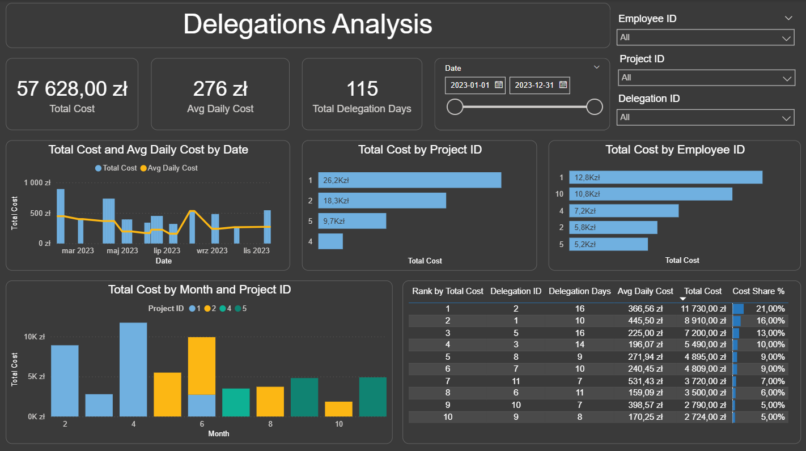
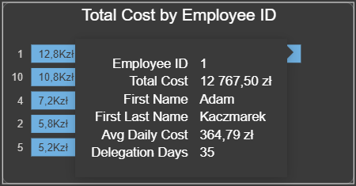
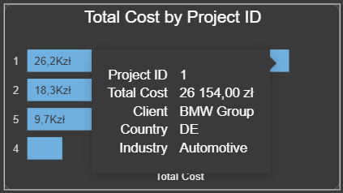

# Analiza kosztów delegacji służbowych

Projekt analityczny SQL + Power BI


## Cel biznesowy projektu

Niewielka firma projektowa (kilkanaście–kilkadziesiąt pracowników) realizuje projekty zagraniczne, w ramach których pracownicy odbywają delegacje służbowe.
Koszty delegacji stanowią istotny element kosztów projektowych, jednak bez odpowiedniego modelu danych trudno analizować je przekrojowo w czasie, per projekt czy per pracownik.

Celem projektu jest:

- Zaprojektowanie relacyjnej bazy danych

- Przygotowanie warstwy analitycznej w SQL

- Zbudowanie tabeli faktów gotowej do analizy w Power BI

- Wykonanie analizy kosztów delegacji w ujęciu biznesowym

Projekt jest SQL-first – cała logika przygotowania danych znajduje się w bazie danych, a Power BI pełni rolę warstwy analityczno-wizualnej.

## Podstawowe pytania

- Jakie są całkowite i średnie koszty delegacji?

- Które delegacje i projekty generują najwyższe koszty?

- Jak rozkładają się koszty w czasie (dzień / miesiąc)?

- Jaki jest udział kosztów poszczególnych projektów i pracowników?

- Czy wysokie koszty wynikają z długości delegacji, liczby osób?

## Zakres i założenia

- Dane syntetyczne, ale realistyczne biznesowo

- Delegacje zagraniczne, różne waluty

- Waluta raportowa: PLN

- Okres danych: 1 rok

- Brak przechowywania agregatów typu total_cost w tabelach źródłowych
→ wszystkie agregacje liczone w SQL lub w miarach Power BI

## Decyzje projektowe

Kluczową decyzją projektową było przygotowanie danych o dziennej granularności:

1 rekord = 1 pracownik × 1 delegacja × 1 dzień

Dzięki temu:

- Nie ma potrzeby liczenia długości delegacji w DAX

- Możliwa jest naturalna analiza trendów

- Power BI pełni rolę czysto analityczno-wizualną

- Logika biznesowa (waluty, alokacja) jest scentralizowana w bazie, co pozwala na podpięcie dowolnego innego narzędzia (np. Tableau, Python) bez powtarzania obliczeń


## Model danych

Model oparty jest na znormalizowanej relacyjnej bazie danych, która wymusza użycie JOIN-ów oraz logiki biznesowej.

Główne tabele:

- employees

- departments

- projects

- delegations

- delegation_employees (relacja M:N)

- costs

- exchange_rates

- date_dim

Relacje:

- delegacja ↔ pracownicy (M:N)

- delegacja → projekt (N:1)

- delegacja → koszty (1:N)

Model został zaprojektowany tak, aby:

- unikać redundancji danych,

- przechowywać dane atomowe,

- umożliwiać elastyczną analizę w SQL i Power BI.

## Struktura skryptów SQL

Lokalizacja: [Skrypty SQL](/SQL%20Scripts/)


### 1. Tworzenie bazy i struktury

- [Utworzenie bazy danych. (1_Create_database.sql)](/SQL%20Scripts/1_Create_database.sql)

- [Definicje tabel wraz z kluczami głównymi i obcymi. (2_Create_tables.sql)](/SQL%20Scripts/2_Create_tables.sql)

- [Indeksy na kluczach obcych oraz kolumnach dat. (3_Create_indexes.sql)](/SQL%20Scripts/3_Create_indexes.sql)

- [Skrypt kontrolny sprawdzający poprawność struktury. (4_check_tables_indexes.sql)](/SQL%20Scripts/4_check_tables_indexes.sql)

### 2. Zasilanie danymi i kontrola jakości

- [Generowanie danych syntetycznych. (5_populate_tables.sql)](/SQL%20Scripts/5_populate_tables.sql)

    - Delegacje o różnej długości.

    - Różna liczba pracowników.

    - Różne typy kosztów (hotel, dieta, transport).

    - Różne waluty.

- [Kontrole jakości danych (spójność, brak danych nieprawidłowych). (6_data_quality.sql)](/SQL%20Scripts/6_data_quality.sql)

### 3. Budowa warstwy analitycznej (fact tables)

Krok po kroku budowana jest warstwa faktów, zwiększając granularność danych:

- [Koszty delegacji przeliczone do PLN. (7A_delegation_costs_pln.sql)](/SQL%20Scripts/7A_delegation_costs_pln.sql)

- [Rozbicie kosztów delegacji na pracowników. (7B_delegation_costs_by_employee.sql)](/SQL%20Scripts/7B_delegation_costs_by_employee.sql)

- [Rozbicie kosztów delegacji na dni. (7C_delegation_costs_per_day.sql)](/SQL%20Scripts/7C_delegation_costs_per_day.sql)

- [Rozbicie kosztów delegacji na pracowników i na dni (7D_delegation_costs_by_employee_per_day.sql)](/SQL%20Scripts/7D_delegation_costs_by_employee_per_day.sql)

### 4. Widoki raportowe

Złożona logika została zamknięta w widokach, które mogą być bezpośrednio używane w narzędziach BI:

- [8A_view_delegation_costs_pln.sql](/SQL%20Scripts/8A_view_delegation_costs_pln.sql)

- [8B_view_delegation_costs_by_employee.sql](/SQL%20Scripts/8B_view_delegation_costs_by_employee.sql)

- [8C_view_delegation_costs_per_day.sql](/SQL%20Scripts/8C_view_delegation_costs_per_day.sql)

- [8D_view_delegation_costs_by_employee_per_day.sql](/SQL%20Scripts/8D_view_delegation_costs_by_employee_per_day.sql)

1 rekord = 1 pracownik × 1 delegacja × 1 dzień

Przykładowa transformacja: Rozbicie kosztów całkowitych na granularność dzienną przy użyciu tabeli kalendarza i relacji M:N

```sql
CREATE VIEW v_delegation_costs_by_employee_per_day AS
SELECT
	de.employee_id,
	dc.delegation_id,
    cal.date AS report_date,    
    CAST(
		dc.total_cost_pln 
        / (DATEDIFF(d.end_date, d.start_date) + 1) 
        / deci.employee_count
        AS DECIMAL(12,4)
	) AS cost_per_day_pln
FROM v_delegation_costs_pln dc
JOIN delegations d
	ON d.delegation_id = dc.delegation_id
JOIN delegation_employees de
    ON de.delegation_id = dc.delegation_id
JOIN (
    SELECT
        delegation_id,
        COUNT(*) AS employee_count
    FROM delegation_employees
    GROUP BY delegation_id
) deci 
	ON deci.delegation_id = dc.delegation_id
JOIN date_dim cal
	ON cal.date BETWEEN d.start_date AND d.end_date
```
Dzięki temu Power BI nie korzysta z tabel źródłowych, a wyłącznie z przygotowanej warstwy analitycznej.

## Przejście do Power BI

Po zbudowaniu finalnej tabeli faktów analiza przenosi się do Power BI, gdzie:

1. tworzony jest model gwiazdy,


2. definiowane są miary (Total Cost, Avg Daily Cost, rankingi),

3. realizowana jest analiza i wizualizacja danych.

Logika biznesowa dotycząca:

- długości delegacji,

- alokacji kosztów na pracowników i dni 

znajduje się w SQL, a nie w DAX.

## Zakres analizy w Power BI


Dashboard składa się z:

- KPI: Total Cost, Avg Daily Cost, Delegation Days

- trendów czasowych

- rankingów projektów, delegacji i pracowników

- tooltipów z kontekstem szczegółowym





Dashboard odpowiada m.in. na pytania:

- jakie są łączne i średnie koszty delegacji,

- które delegacje, projekty i pracownicy generują najwyższe koszty,

- jak zmieniają się koszty w czasie,

- jaki jest udział kosztów poszczególnych projektów i pracowników.

- Power BI pełni rolę warstwy analitycznej i prezentacyjnej, nie transformacyjnej,

- tooltipy z kontekstem szczegółowym

## Wnioski biznesowe

- 30% delegacji wygenerowało 50% kosztów (Delegation_ID: 2, 1, 5) 

- większość kosztów pochodziła z jednego projektu, co sugeruje jego dominujący wpływ na budżet delegacji (Project_ID 1)

- jeden z pracowników wygenerował ponad 38% kosztów projektu, co wynikało z najdłuższego czasu pracy na delegacjach

- większe koszty w pierwszej połowie roku wynikały z większej liczby dni delegacji 

## Technologie

- MySQL: Silnik bazy danych i modelowanie relacyjne
- SQL: Zaawansowane zapytania, CTE, przygotowanie warstwy faktów
- Power BI: Modelowanie typu Star Schema oraz wizualizacja
- DAX: miary
- Power Query: podstawowa transformacja tabel

## Możliwe dalsze kroki

- Dodanie budżetów projektowych i analizy odchyleń,
- analiza kosztów planowanych vs rzeczywistych,
- rozszerzenie analizy o efektywność delegacji.
